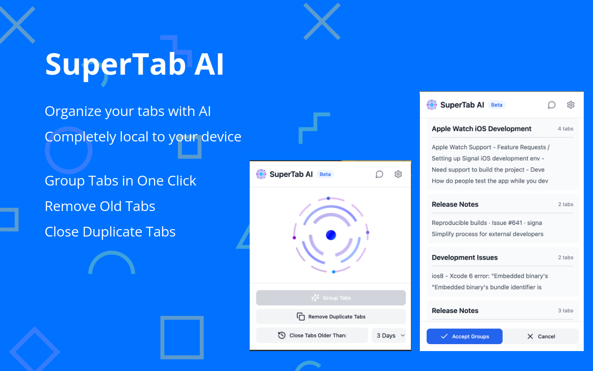
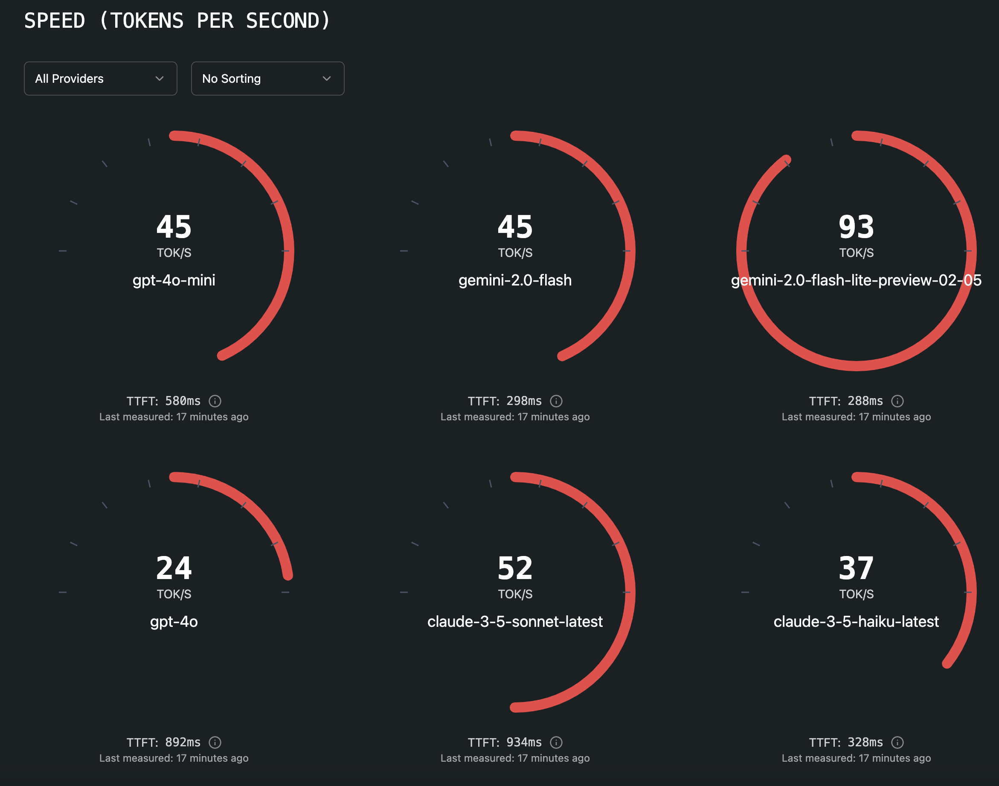

# 🚀 AI Projects I've Built

Welcome to my innovation showcase! As a passionate AI developer and entrepreneur, I've had the privilege of bringing cutting-edge artificial intelligence solutions to life. Each project below represents a unique challenge solved through creative application of AI technology, delivering real value to users and businesses alike.

## CogniCare AI

**CogniCare AI:** AI Platform for Mental Health Counselors to provide better care to their clients through recording and automatically transcribing patient sessions, generating clinical notes, and creating treatment plans.
<iframe src="https://drive.google.com/file/d/1iH_gaHz1ppQGcTEY5-feParZZBJvABVP/preview" width="640" height="480" allow="autoplay"></iframe>

## [SuperTab AI](https://chromewebstore.google.com/detail/supertab-ai/ppglbhanbmaokfhaafhpjhlpjnaneido)

**[SuperTab AI](https://chromewebstore.google.com/detail/supertab-ai/ppglbhanbmaokfhaafhpjhlpjnaneido)**: AI Chrome extension for tab management that can locally run an LLM in a browser, group relevant tabs automatically, title the groups, and manage old tabs.

## [AI Speed Test](https://llm-speed-o-meter.lovable.app/)

**[AI Speed Test](https://llm-speed-o-meter.lovable.app/)**: A platform for testing the speed throughput and response times of AI models from different LLM providers.

